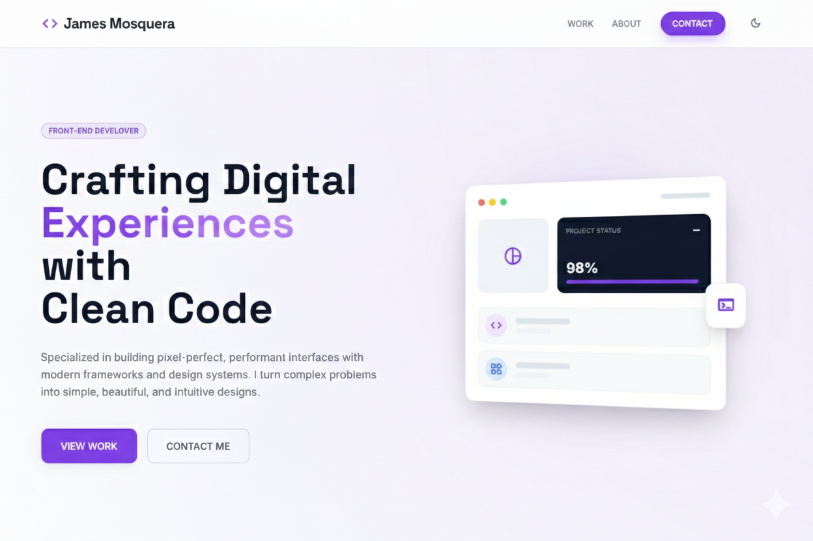

# James Mosquera — Front-End Developer Portfolio

Portfolio personal para presentar proyectos, stack técnico y contacto profesional. Enfocado en UI pixel-perfect, performance y accesibilidad.

## Sitio en producción

https://portafolio-james-mosquera.vercel.app

## Capturas



## Tecnologías

- React
- TypeScript
- Vite
- Vercel (despliegue)
- @vercel/speed-insights
- Google Search Console
- Tailwind CSS
- @tailwindcss/forms
- PostCSS
- Autoprefixer
- @vitejs/plugin-react
- i18next
- react-i18next
- Resend (servicio de envío de emails, modo DEMO)
- Node.js / npm (requisitos de ejecución).

## Instalación y uso local

**Requisitos:** Node.js

1. Instala dependencias:
   `npm install`
2. Inicia el entorno local:
   `npm run dev`

## Scripts disponibles

- `npm run dev` — servidor de desarrollo
- `npm run build` — build de producción
- `npm run preview` — preview del build

## Variables de entorno

Crear `.env.production` (o variables en Vercel):

- `VITE_SITE_URL` = URL pública del sitio (sin slash final)

## Estructura de carpetas (resumen)

```
public/
src/
  components/
  assets/
```

## Contribución

Este proyecto es personal. Si deseas proponer mejoras, abre un issue.

## Licencia

Todos los derechos reservados.

## Contacto

- Email: johnjamesmosquera3@gmail.com
- LinkedIn: https://www.linkedin.com/in/john-james-mosquera-rozo-4b22bb229/
- GitHub: https://github.com/JotaJotaM1
